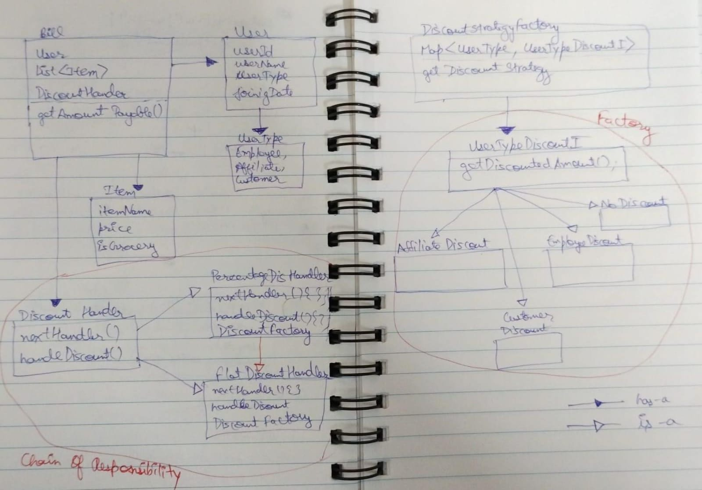

# retail

UML: Check UML.jpeg



## Requirements
- Java 11 or higher
- Maven

## Running the Application
1. Clone the repository:
    ```bash
    git clone https://github.com/atulgupta04n/retail.git
    ```
2. Navigate to the project directory:
    ```bash
    cd retail
    ```
3. Build the project:
    ```bash
    mvn clean install
    ```
4. Run the application:
    ```bash
    mvn spring-boot:run
    ```

## Running Tests
1. Navigate to the project directory:
    ```bash
    cd retail
    ```
2. Run the tests:
    ```bash
    mvn test
    ```